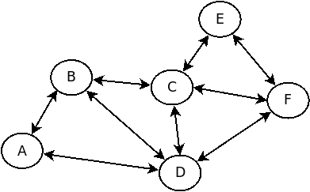

# Getting re-Started with Python

## Python version

There are different versions of Python, in this course you have to use
version 3 or higher. To see what version you are using type in a
shell/terminal:

    $ python --version

If you have a version 3.0 or higher you can skip to the next section,
otherwise continue reading. On some operating systems there are
multiple versions of python available:

    $ python3 --version

you can create a python environment to make sure you always use the
correct version of python (and pip):

    $ python3 -m venv ~/python3_env

To activate this environment type:

    $ source ~/python3_env/bin/activate

And to deactive it type:

    $ deactivate

To make sure this python3 environment is always activated when you
start a shell, so you won't forget, you can add the activation to your
Bash startup file (.bashrc) by once running:

    $ echo -e "\n# activate python3 environment:\nsource ~/python3_env/bin/activate" >> ~/.bashrc

If you are on Mac OS, you also need to add this (to .bash_profile)
once by running:

    $ echo -e "\n# source .bashrc:\nif [ -r ~/.bashrc ]; then\n  source ~/.bashrc\nfi" >> ~/.bash_profile

Start a new shell and check if it works!, using the wrong version will
cause problems later.

## Typing

In Python all values have a specific type. Python has various built-in types:

| type    | description                     | example                | mutability |
| ------- | ------------------------------- | ---------------------- | ---------- |
| `int`   | whole number                    | `5`, `-8`, `2*3`       | immutable  |
| `float` | floating point number           | `5.0`, `3.8`, `4/1`    | immutable  |
| `bool`  | boolean                         | `True`, `False`, `3>1` | immutable  |
| `str`   | string                          | `"hello"`, `'world'`   | immutable  |
| `list`  | list of same type               | `[1,2,3,4]`            | mutable    |
| `tuple` | groups possibly different types | `(1,2,'abc',True)`     | immutable  |

more later... 

Python is dynamically-typed language, that means a type is associated
with a value and not with a variable (like in the C programming
langue). Because of this a variable can change type when you give it a
new value:

    >>> my_var = 42
    >>> print(  type(my_var) )
    <class 'int'>
    >>> my_var = 3>1
    >>> print( type(my_var) )
    <class 'bool'>
    >>> my_var = "hello world"
    >>> print( type(my_var) )
    <class 'str'>

When you use a value it is important to know its type
because expressions behave differently for different types:

    >>> my_var = 42
    >>> print( my_var+my_var )
    84
    >>> my_var = "hello"
    >>> print( my_var+my_var )
    hellohello

Sometimes it is unclear what type a value has, for example the value
your get from a function. In those cases you could try to:

    def my_function():
      return [ ('a',1), ('b',2), ('c',3) ]

    print( my_function() )               # print the value and have a look
    print( type(my_function())  )        # or print the type of the value
    if isinstance(my_function(), list):  # or test if the value has a specific type
       print("the type is a list")

## (im)mutable

Some types like 'int' are 'immutable', meaning that the value can not
be changed. Other types like 'list' are 'mutable', they can
change. The difference is important, lets first look at an immutable
type:

    >>> v1 = 111       # 'int': immutable type
    >>> v2 = v1
    >>> v1 += 222      # value can not mutate so v1 gets bound to a new value
    >>> print("v1: ", v1, "v2: ", v2, "id(v1):", id(v1), "id(v2):", id(v2)  )
    v1:  333 v2:  111 id(v1): 139754131600176 id(v2): 10918016

The output is as expected, v1 is changed and v2 still has the intial
value of 111. For mutable types this is different:

    >>> v1 = [100]     # 'list': mutable type
    >>> v2 = v1
    >>> v1.append(222) # mutates the existing value, so also changes v2
    >>> print("v1: ", v1, "v2: ", v2, "id(v1):", id(v1), "id(v2):", id(v2)  )
    v1:  [100, 222] v2:  [100, 222] id(v1): 139754131779912 id(v2): 139754131779912

Surprise!, v2 now has the same value a v1 even though v1 is changed
after assignment 'v2 = v1'. This is because the assignment 'v2 = v1'
binds variable v2 to the same value v1 is bound to. They now share the
same value, the same memory. This can also be seen by observing
'id(v1)' and 'id(v2)' are the same. Because it is a mutable type the
value can be changed and a change in v1 will now also effect v2 and
vice versa.

Sometimes you don't want this and want 'v2' to have an independent
copy of the value of 'v1'. One way of doing this is to use function
deepcopy():

    >>> import copy              # requires module 'copy'   
    >>> v1 = [100]     # 'list': mutable type
    >>> v2 = copy.deepcopy(v1)   # deepcopy makes an independent copy
    >>> v1.append(222) # changes the existing value
    >>> print("v1: ", v1, "v2: ", v2, "id(v1):", id(v1), "id(v2):", id(v2)  )
    v1:  [100, 222] v2:  [100] id(v1): 139754131347912 id(v2): 139754131363720

Now v2 is an indepentent copy of the initial value and is not effected
by any change in v1. But keep in mind that copying large values (a list
with many thousands of elements) can be slow and more memory is going
to be needed, so only make an independent copy if you really need one.

## Readability

Companies and research institutes can have millions of lines of source
code that they have to understand in order to succesfully make changes
to. Therefore it is important that software is as readable as possible
even though its logic might be complex. Therefore you will also be
graded on the readability of your source code even though you probably
will never have to look at it again after you pass this course.

- think carefully about the names you choose

      s = 0             # bad
      sum = 0           # better
      sum_of_grades = 0 # good

- write comments when they are useful 

      width = 25        # assign 25 to width, not useful
      length = math.sqrt( x**2 + y**2 )  # use Pythagoras to compute length, useful

- think about problem decomposition (splitting in different parts)

  Prefer many small functions that each do their own thing over a few
  large functions that do many things. With many functions you can
  give each function a nice name and you can reuse the same function
  elsewhere. The result is a simpler structure that is less complex to
  work with.

      def is_average_grade_above_5(grades):
         sum_of_grades = 0
         for grade in grades:
             sum_of_grades += grade
         average_grade = sum_of_grades/len(grades)
         return average_grade>5

      # bad, does 3 things: compute sum, compute average, test
      #--------------------------------------------------------------
      # good, each function does its own thing and has a nice name
      
      def sum_of_grades(grades): 
         sum_of_grades = 0
         for grade in grades:
             sum_of_grades += grade
         return sum_of_grades

      def average_grade(grades):
         return sum_of_grades(grades)/len(grades)
     
      def is_average_grade_above_5(grades):  # good
         return average_grade(grades) > 5
     
- don't repeat yourself

  Don't copy-past code and change it a bit, instead make a reusable
  function that you can call from different places.

- shorter is generally better

  Don't write functions that already exist. For example Python already
  has a way to compute the sum of numbers so we don't have to write
  sum_of_grades() again, instead search and use already existing
  function sum(). Unless ofcourse the goal of the exercise is to write
  it yourself. Also take some time to think about shortening your code
  after writing it:

      def in_between(x,min,max):  # bad
          result=True
          if x<min:
             result=False
          if x>max:
             result=False
          return result

      def in_between(x,min,max):  # good
          return x>=min and x<=max
  
## Debugging

A bug is an error in your code that causes a wrong output with some
specific input. When programs get larger or more complex you often
spend more time finding and fixing bugs than you spend writing new
code even if the bug is caused by a tiny little error. This is normal
and can be frustrating, but don't let a bug get you all worked
up. Instead write your code carefully (think it through, don't put
thinking off until testing) and try to find bugs early by testing
early and often. After adding every few lines of code make sure your
program still does what you think it does. Because if you don't test
often and a bug appears you will not know where to look for it and you
will likely have to spend more time debugging. Debugging is an
important skill to develop.

- print: You can test by temporarily adding print statements to your
code, run it, and analyse the output:

      def sum_of_grades(grades): 
           sum_of_grades = 0
           for grade in grades:
               print("sum_of_grades:",sum_of_grades)  # temporary print
               sum_of_grades += grade
           return sum_of_grades

- debugger: You can also use a debugger to step through your code, see
how it executes and see how values get changed:

  <https://www.youtube.com/watch?v=ChuU3NlYRLQ>

- test set: Make a small test set to easily test with. For example if
  you want to count how many times each words occurs in a large text
  then testing with a large text will result in a lot of loop
  iterations and a lot of data that is hard to check. Therefore it is
  a good idea to first test with a your own small text with just a few
  words. That way you can easily check each iteration and know what
  the right output should be. You can incrementally make your test set
  harder as you write more code. Think about what the most difficult
  input would be (possible edge cases?) and incrementally add those in
  your test set.

## Recursion

Recursion is a powerful tool that allows you to solve some complex
problems in only a few lines of code. A recursive function is a
function that calls itself, we will look at some examples.

### Factorial

The factorial function can be defined iteratively as:

    factorial(n) = 1*2*3*...*n

for example the factorial of 4 is 1*2*3*4 = 24 and we can write an
iterative python program to compute the factorial like so:

    def factorial(n):
        result=1
        for i in range(1,n+1):
            result*=i
        return result
    factorial(4)

Because we use a for-loop in our implementation to do all the work we
call this an iterative implementation. But we can also use a recursive
definition of factorial:

    factorial(1) = 1
    factorial(n) = factorial(n-1)*n

for example the factorial of 4 with this definition is evaluated as:

                    factorial(4)
               factorial(3) * 4
          factorial(2) * 3  * 4
    factorial(1)  * 2  * 3  * 4
              1   * 2  * 3  * 4
                             24

We can write a recursive python implementation as:

    def factorial(n):
        if n==1:                 # stop condition
            return 1
        return factorial(n-1)*n  # function calling itself
    factorial(4)

A recursive function is a function that is calling itself like
factorial(n) does instead of using a loop. A function calling itself
will keep calling itself until the program crashes with an error
unless there is a stop condition, also called 'base case'. The stop
condition here is "n==1" because the factorial of 1 is 1 and we don't
need to continue further.

### Assignment: multiply

Write a recursive multiply(a,b) python function that multiplies
integer 'a' with integer 'b' without for/while loops and without using
the '*' operator but instead by using recursion and repeated addition
(a+a+a+...). A recursive definition for multiply is:

    multiple(a,0) = 0
    multiple(a,n) = multiple(a,n-1)+a

example evaluation:

                 multiple(4,3)
            multiple(4,2) + 4
        multiple(4,1) + 4 + 4
    multiple(4,0) + 4 + 4 + 4
                0 + 4 + 4 + 4
                           12

### Print all lists

For function factorial() we can either make an iterative or a recursive
implementation, but there are also problems where only a recursive
implementation can be used. For example printing all possible lists
with length 3 with elements 'a' and 'b' can be easily recursively
implemented like:

    def print_all_lists(list, n, elements):
        if n==0:                     # stop condition
            print(list)
        else:
            for i in elements:
                list.append(i)       # add element
                fill_list_recursively(list, n-1, elements)
                list.pop()           # remove to add other element later
    
    print_all_lists([], 3, ['a','b'])

Execute the program and see what happens when you print all lists up
to length 4 or add another element 'c'. The execution can be
visualized as:

- At first the option 'a' is selected in the for-loop at all three
levels.

- After the first print the function returns, the last choice is
removed, and the next option 'b' is selected at level 3.

- The function returns and removes twice as the for-loop in level 3
completes. Now we are back in the for-loop of level 2 and select next
option 'b' and option 'a' in a new for-loop at level 3.

This process continues until the for-loop in level 1 is
completed. Notice that our list is of a mutable type so there is only
one list that is shared by all the levels.

## Assignment: path finding

Given the graph:

implement recursive function print_paths():

    def print_paths(path, destination, edges):
        print("path: ",path)

    print_paths(['A'],'E',[ ('A','B'), ('A','D'), ('B','C'), ('B','D'), ('C','E'), ('C','F'), ('C','D'), ('D','F'), ('E','F') ])

so that it prints all valid paths from 'A' to destination 'E'. A path
it valid if it visits each node at most once. The correct number of
possible path is 13 to check your answer.
