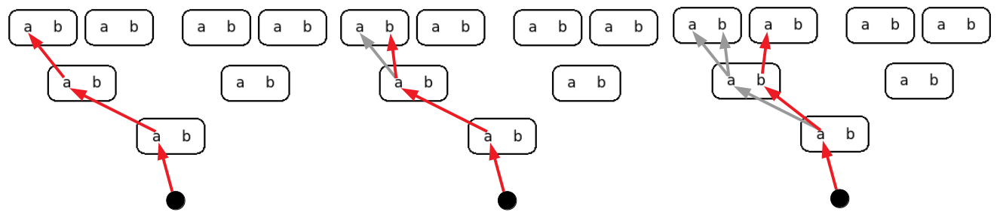

## Recursion

Recursion is a powerful tool that can help you to solve some complex
problems in only a few lines of code. A recursive function is a
function that calls itself, we will look at some examples.

### Factorial

The factorial function can be defined iteratively as:

    factorial(n) = 1*2*3*...*n

for example the factorial of 4 is 1 x 2 x 3 x 4 = 24 and we can write
an iterative python program to compute the factorial like so:

    def factorial(n):
        result=1
        for i in range(1, n+1):
            result *= i
        return result
        
    print( factorial(4) ) # 24

Because we use a for-loop in our implementation to do all the work we
call this an iterative implementation. But we can also use a recursive
definition of factorial:

    factorial(1) = 1
    factorial(n) = factorial(n-1) * n

for example the factorial of 4 with this definition is evaluated as:

                    factorial(4)
               factorial(3) * 4
          factorial(2) * 3  * 4
    factorial(1)  * 2  * 3  * 4
              1   * 2  * 3  * 4
                             24

We can write a recursive python implementation as:

    def factorial(n):
        if n==1:                   # stop condition
            return 1
        return factorial(n-1) * n  # function calling itself
        
    print( factorial(4) ) # 24

A recursive function is a function that is calling itself instead of
using a loop. A function calling itself will keep calling itself until
the program crashes with an error unless there is a stop condition,
also called 'base case'. The stop condition here is "n==1" because the
factorial of 1 is 1 and we don't need to continue further.

## Assignment: multiply

Write recursive function multiply(a,b) that multiplies integer 'a'
with integer 'b' without using for/while loops and without using the
'*' operator but instead by using repeated addition. A recursive
definition for multiply is:

    multiply(a,0) = 0
    multiply(a,b) = multiply(a,b-1) + a

an example evaluation is:

                 multiply(4,3)
            multiply(4,2) + 4
        multiply(4,1) + 4 + 4
    multiply(4,0) + 4 + 4 + 4
                0 + 4 + 4 + 4
                           12

### Print all lists

For function factorial() we can either make an iterative or a
recursive implementation, but there are problems where only a
recursive implementation can be used. For example printing all
possible lists of length 3 with elements 'a' and 'b' can be
surprisingly easily implemented with use of recursion:

    def print_all_lists(list, n, elements):
        if n==0:                # stop condition
            print(list)
        else:
            for i in elements:
                list.append(i)  # add element to list
                print_all_lists(list, n-1, elements)
                list.pop()      # remove last element from list
    
    print_all_lists([], 3, ['a','b'])

Execute the program and see what happens when you print all lists of
length 4 or add another element 'c'.

We want to build a list of n elements and for each choice we have 2
options, elements 'a' and 'b'. To solve this problem recursively we
can first add 'a' and then simply build a list of the remaining n-1
elements (note the recursive definition), and then remove 'a' and add
'b' and again build a list of the remaining n-1 elements. The
evaluation can be visualized as:

- At the start the first element 'a' is selected in the for-loop at
all three levels.

- After the first print the function returns, the last choice is
removed, and the next option 'b' is selected at level 3.

- After the next print the function returns and removes twice as the
for-loop in level 3 completes. Now we are back in the for-loop of
level 2 and select the next option 'b' and option 'a' in a new
for-loop at level 3.

This process continues until the first for-loop in level 1 is
completed. Notice that our list is of a mutable type so there is only
one list that is shared by all levels, hence the pop() function to
remove the previously added element at a level.

## Assignment: path finding

Given the graph:

implement recursive function print_paths():

    def print_paths(path, destination, edges):
        print("path: ",path)

    print_paths(['A'],'E',[ ('A','B'), ('A','D'), ('B','C'), ('B','D'), ('C','E'), ('C','F'), ('C','D'), ('D','F'), ('E','F') ])

so that it prints all valid paths from 'A' to destination 'E'. A path
is valid if it visits each node at most once. The correct number of
possible path is 13 (to check your answer).
